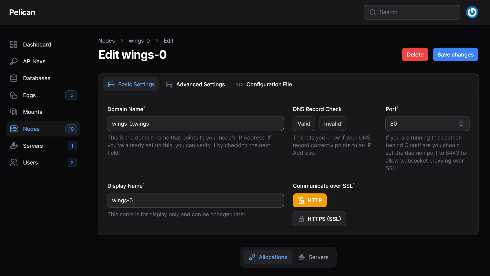

# pelican-k8s
The Pelican game panel in a k8s cluster

## Installation

### Dependencies

On your k8s cluster, be sure to have thoses dependencies installed and configured :
- Traefik
- Cert-Manager
- Any default volume provider

### Configuration

You can adjust your settings in the directory `k8s/overlays/production/config/` and change any `<VARIABLE>` with your own values.

**! Important !**

In `k8s/overlays/production/resources/wings.yaml`, change the value of `spec.replicas` to the number of nodes you have.

In the file `k8s/overlays/production/resources/ingress.yaml`, change the value of `spec.rules.host` with your own domain name.

### Deployment

To deploy your game panel, run this command :
```bash
kubectl apply -k ./k8s/overlays/production/
```

That will deploy the requested ressources to your cluster.

But that will not create the wings into the pelican panel. Until I'll get more time to write an automatic script for that, you'll need to do it manually.

Go to your panel and add a new node like this image :



When that's done, got to the `Configuration file` tab of that page and copy the content of the `/etc/pelican/config.yml`.

On your terminal you'll need to connect to your wings pod to create the configuration file, do it with this command :
```bash
kubectl exec -itnpelican pods/wings-0 -c waiting-config -- vi /etc/pelican/config.yml
```

Press `I` so you go into `Insert mode`, then paste the content of your configuration file and press `ESC` to exit `Insert mode`. Then type `:wq` to save and exit the file.

The pod will exist the `waiting-config` state to start the docker and wings containers.

You'll need to do that for every wings nodes you have.
